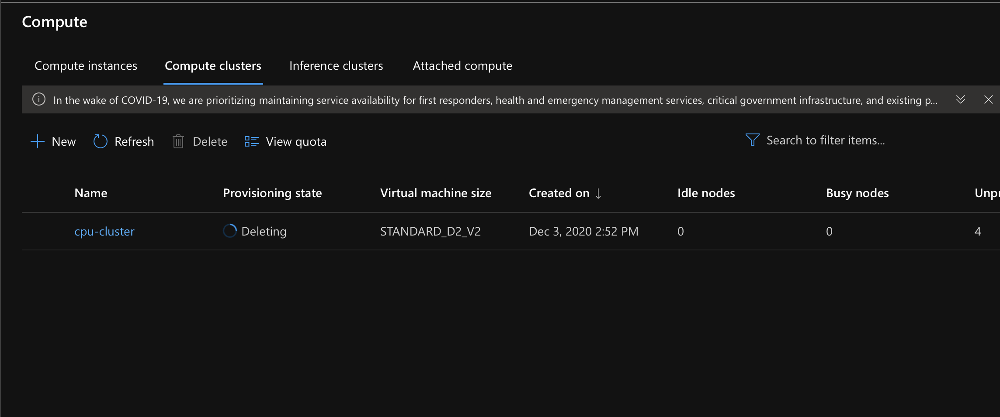

# Optimizing an ML Pipeline in Azure

## Overview
This project is part of the Udacity Azure ML Nanodegree.
In this project, we build and optimize an Azure ML pipeline using the Python SDK and a provided Scikit-learn model.
This model is then compared to an Azure AutoML run.

## Summary
[//]:< In 1-2 sentences, explain the problem statement: e.g "This dataset contains data about... we seek to predict..."**>
This dataset contains information about clients from a financial institution. The desire prediction or "goal" is to know if clients will subscribe to a fixed term deposit with this institution.

[//]:<**In 1-2 sentences, explain the solution: e.g. "The best performing model was a ..."**>
To achieve the later goal, we modeled the data using two different tools available in Azure Machine Learning package: 
* We used the Azure hyperdrive tool to vary parameters of a LogisticRegression model from Scikit-learn.
* We used the Azure automated machine learning (automated ML) for a *classification* task.

The primary metric used to compare both models is *accuracy*. Accuracy is defined as the ratio of predictions that exactly match the true class labels.

The best performing model based on the accuracy metric was obtained using the Azure AutoML pipeline. Although the difference between both approaches was very small.

## Scikit-learn Pipeline
[//]:<**Explain the pipeline architecture, including data, hyperparameter tuning, and classification algorithm.**>
A pipeline is a representation of the automation process that we want to run. In this example, we automated the model training process. 
We used the Azure Machine Learning HyperDrive package to tune the model hyper-parameter space. This package let us run experiments in parallel to efficiently find the appropriate set of  hyper-parameters that maximize or minimize a certain metric. 

Since out goal is to know what type of client is more likely to open a fixed deposit account, we need to perform a classification task. We used the LogisticRegression model form Scikit-learn library. It has the advantage that its predictions are well calibrated since it directly optimizes the log-loss function.

The LogisticRegression model has many parameters. To star our analysis, we chose to vary only two of them: 
* The inverse of regularization strength, *C* , smaller values specify stronger regularization. Regularization prevents overfitting of the data. 
* The maximum number of iterations taken for the solvers to converge, *max_iter*. We need to find the sweet spot between finding convergence and computing time and varying this parameter allow us to achieve that.

The default values were used for the rest of parameters:
* penalty=l2, ridge regression.
* solver=lbfgs, which is robust for unscaled datasets. 
* multi_class=auto, 
* class_weight=none, 
* fit_intercept=True, bias added to decision function.
* intercept_scaling=1,
* tolfloat=1e-4, tolerance for stopping criteria.

Now for the automation process, we need to define the following tasks:
 * Define the parameter search space. In his example, it was given by the range of values of *C* and *max_iter* that we explored. In addition, the HyperDrive tool gives different options to explore the parameter search space. Since this is our first exploration, we chose a random sampling exploration (*RandomParameterSampling*). It reduces the amount of computing time. 

    *  For the variable *C*, we are using a range of values uniformly distributed between 0.1 and 1, since we did not know how strong we need to the regularize our dataset. 
    * For variable *max_iter*, we are using multiple choice values 100, 1000, 10000 to determine the right choice for solver's convergence and computing time.
 
 * Specify a primary metric. We use **accuracy** as our primary metric, and since we look for an accuracy value closer to 1, we need to maximize the primary metric.

 * Specify  an early termination policy for low-performing runs. To limit computing time and thus resources, runs that have low performance, can be terminated. Azure provide several options for termination. We use **BanditPolicy**. This policy let us terminate runs where the primary metric is not within the specified slack factor compared to the best performing run. We use **slack_factor** = 0.1, **evaluation_interval**=1 (how frequent the policy is applied), and **delay_evaluation**=5 (how many evaluations the policy waits to evaluate after the start of the run).

 * Allocate resources. To control, limit, or scale resources, we can modified the maximum number of runs, maximum number of concurrent runs, and maximum duration of the runs.  

With all the previous settings and information we configured the experiment and run it. 

The best run which was obtained with the following hyper-parameters: *C= 0.5617, max_iter=1000*, gave us an accuracy of 0.9150. Its computing time was 1,180 seconds.

[//]:<**What are the benefits of the parameter sampler you chose?**>
[//]:<**What are the benefits of the early stopping policy you chose?**>

## AutoML
Automated machine learning is a tool that help us in the process of producing and comparing dozens of models for the same experiment. Thus, it help us to accelerate the time that it takes to get the right model. For AutoML, we only need to provide the task that we need to perform. It can be either Classification, Regression, or Forecast and choosing the target metric to be optimized. In this example, we use Classification and accuracy as the target metric.

The best model was a **VotingEnsemble** model. Automated machine learning supports ensemble models which are the combination of multiple models. AutoML gives the ability to use two methods for making the ensembles: voting and stacking ensembles. The Voting scheme predicts based on the weighted average of predicted class probabilities.

The best model given by AutoML use a Voting ensemble of 10 estimators. Among them, we got:
* 6 Xgboost classifiers
* 3 Lightgbm classifiers
* 1 Randomforest classifier

Soft was the voting scheme chosen and the weights used to make the predictions were weights=[0.143, 0.214, 0.071, 0.143, 0.071, 0.071, 0.071, 0.071, 0.071, 0.071].

The accuracy given by the best model was **acurracy=0.9168** and its computing time was 2,257.9s

[//]:<LightGBM is a high-performance gradient-boosting framework based on decision tree algorithms. It is used for ranking, classification, and many other machine-learning tasks.LightGBM uses the leaf-wise tree growth algorithm, wich can converge much faster. However, the leaf-wise growth may be over-fitting if not used with the appropriate parameters. Among the important parameters are: num_leaves, max_depth,min_data_in_leaf>

[//]:<**In 1-2 sentences, describe the model and hyper-parameters generated by AutoML.**>

## Pipeline comparison
[//]:<**Compare the two models and their performance. What are the differences in accuracy? In architecture? If there was a difference, why do you think there was one?**>
The best model given by AutoMl scored slightly better than HyperDrive best run, but the difference is very small approximately ~0.0018. However, it will test in millions of clients that number is significant. In regard to computing time, the HyperDive was the fastest since it used parallel runs to performed the hyper-parameter search and the AutoMl was run locally. 
## Future work
[//]:<**What are some areas of improvement for future experiments? Why might these improvements help the model?**>
There are two important steps to be performed in both approaches. In the preprocess data step, the dataset is unbalance, thus we need to balance the data which could be done by oversampling. The other one, if is not possible to balance the data, we should change accuracy as the primary metric. Accuracy is not the best metric to use since its value will be influence to the largest class. For instance, if we look at the F1 score metric macro, we already see that for the HyperDrive run has a much lower value=0.731, whereas for the AutoMl model, the same metric is 0.773. There is a significant difference of 0.05. This change of metric will provide better insight for model searching and hyperdrive tuning.

## Proof of cluster clean up
[//]:<if  you did not delete your compute cluster in the code, please complete this section. Otherwise, delete this section.**>

[//]:<**Image of cluster marked for deletion**>

## References
swatig007. “Tune Hyperparameters for Your Model - Azure Machine Learning.” Tune Hyperparameters for Your Model - Azure Machine Learning | Microsoft Docs, docs.microsoft.com/en-us/azure/machine-learning/how-to-tune-hyperparameters. 

Ali, Moez. “GitHub Is the Best AutoML You Will Ever Need.” Medium, Towards Data Science, 6 Aug. 2020, towardsdatascience.com/github-is-the-best-automl-you-will-ever-need-5331f671f105. 

